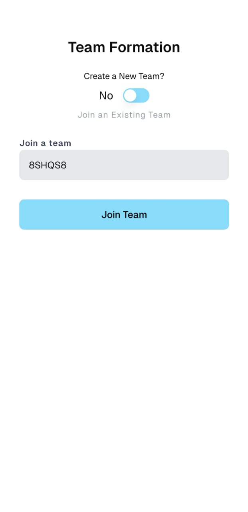
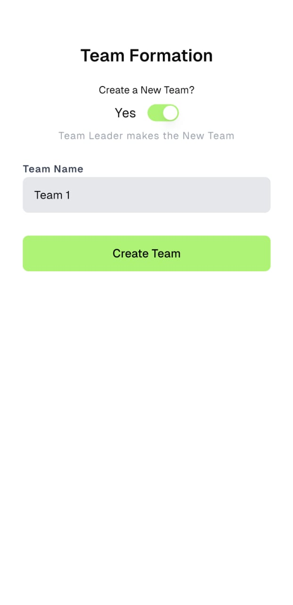
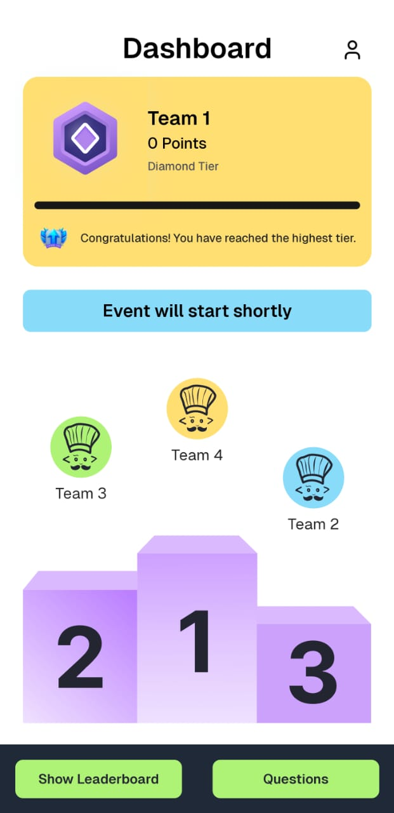
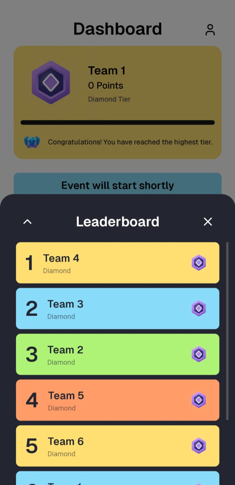
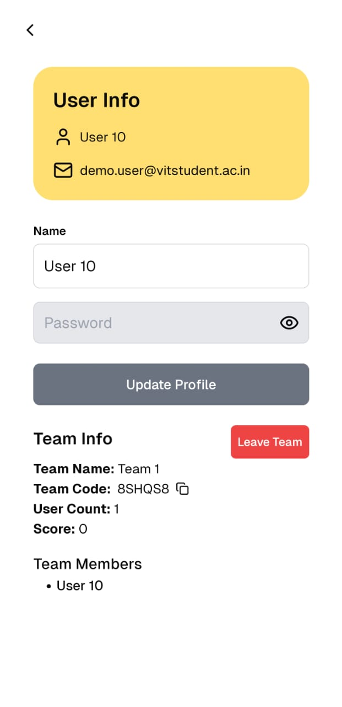

<p align="center"><a href="https://www.codechefvit.com" target="_blank"></a>
</p>

<h2 align="center"> Clueminati 2.0 </h2>
<br/>

> <p>Clueminati is CodeChef VIT's annual treasure hunt event, returning for its second edition in 2024. This web application facilitates team creation, score tracking, and real-time leaderboard management, providing participants with a seamless and engaging experience throughout the competition. 

</p>

## 🌐 Deploy

[https://clueminati24.codechefvit.com](https://clueminati24.codechefvit.com)

## ⚙️ Tech Stack:

- Next.js
- TypeScript
- Tailwind CSS
- React Hot Toast
- Axios
- Shadcn

## 💡 Features:

- Admin access to oversee and manage teams, monitor scores, and handle leaderboard updates efficiently.
- You can either join a team or create a new one with just a few clicks.
- A dynamic leaderboard.
- A fully functional portal with support for gestures and compatibility across devices with varying screen resolutions.


## 🖼 Screenshots

<table>
  <tr>
    <td align="center">
      
      <br/>
      <p>Login</p>
    </td>
    <td align="center">
      
      <br/>
      <p>Join Team</p>
    </td>
    <td align="center">
      
      <br/>
      <p>Create Team</p>
    </td>
  </tr>
  <tr>
    <td align="center">
      
      <br/>
      <p>Dashboard</p>
    </td>
    <td align="center">
      
      <br/>
      <p>Leaderboard</p>
    </td>
    <td align="center">
      
      <br/>
      <p>View Profile</p>
    </td>
  </tr>
</table>


## 🏁 Get Started

To get started, fork your own copy and clone the master branch. To clone a branch you can run the following:

```bash
git clone -b master https://github.com/<Your username>/<repo-name>
```

Run these commands on your bash/terminal and open it in a code editor of your choice.

Run the following to install all the dependencies:

```bash
pnpm i
```

To start your development server run:

```bash
pnpm dev
```

## 📝 Note:

- To have the entire functionality please note that you will have to either create your own backend.
- Make sure you set user role as 'admin' in database to access all the admin specific APIs.
- You can also make a forked copy of the Clueminati Portal by heading over to: https://github.com/CodeChefVIT/clueminati-2.0-webapp.git


## 🚀 Contributors

<table>
<tr align="center">
	<td>
	<p align="center">
		
	</p>
	<p style="font-size:17px; font-weight:600;">Aaditya Mahanta</p>
	<p align="center">
		<a href = "https://github.com/aditansh"></a>
		<a href = "https://www.linkedin.com/in/aadityamahanta/">
			
		</a>
	</p>
  </td>
  
<td>
	<p align="center">
		
	</p>
	<p style="font-size:17px; font-weight:600;">Nishant Gupta</p>
	<p align="center">
		<a href = "https://github.com/NishantGupt786"></a>
		<a href = "https://www.linkedin.com/in/nishant-gupta-12913221b/">
			
		</a>
	</p>
</td>

<td>
	<p align="center">
		
	</p>
	<p style="font-size:17px; font-weight:600;">Abhinav Ganeshan</p>
	<p align="center">
		<a href = "https://github.com/Abh1noob"></a>
		<a href = "https://www.linkedin.com/in/abhinav-gk/">
			
		</a>
	</p>
</td>
</tr>

<tr align="center">
<td>
	<p align="center">
		
	</p>
	<p style="font-size:17px; font-weight:600;">Heet Jatania</p>
	<p align="center">
		<a href = "https://github.com/AqViolet"></a>
		<a href = "https://www.linkedin.com/in/heet-jatania-4a1294275/">
			
		</a>
	</p>
</td>

<td>
	<p align="center">
		
	</p>
	<p style="font-size:17px; font-weight:600;">Aditi Saxena</p>
	<p align="center">
		<a href = "https://github.com/aditisaxena259"></a>
		<a href = "https://www.linkedin.com/in/aditi-saxena-4674ab222/">
			
		</a>
	</p>
</td>

<td>
	<p align="center">
		
	</p>
	<p style="font-size:17px; font-weight:600;">Ruhi Doshi</p>
	<p align="center">
		<a href = "https://github.com/ruhi-doshi"></a>
		<a href = "https://www.linkedin.com/in/ruhi-doshi-69542628b/">
			
		</a>
	</p>
</td>
</tr>
</table>

## License

[](http://badges.mit-license.org)

<p align="center">
	Made with :heart: by <a href="https://www.codechefvit.com" target="_blank">CodeChef-VIT</a>
</p>
